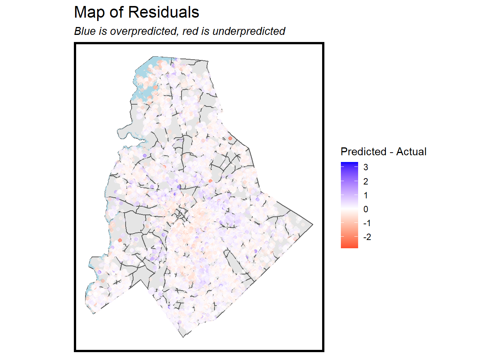

## [Bio](/index.md) - [Urban Analytics](/portfolio.md) - [Advocacy](/advocacy.md) - [Education](/education.md) 

---

## MUSA Practicum

My team and I built a latent bus ridership demand model and interactive app to allow El Paso planners to reconfigure their local bus network to interoperate better with the newly built Sun Metro bus rapid transit system.

[JavaScript Dashboard](https://chuembucket.github.io/ElPaso-Bus-Network1/App/site/)

[RMarkdown](https://pennmusa.github.io/MUSA_801.io/project_30/index.html)

### Dashboards

[Fishtown Dashboard](x.com)

### Markdown reports

[Indego Bike Share Rebalancing Plan](/bsrmd.html)

---

[San Francisco Parking Demand Prediction](/toknit.html)

---
[Philly 311 Abandonded Vehicle Reports](/geospatialriskmd.html)

---
[Predicting Home Prices in Charlotte, NC](/midterm.html)

